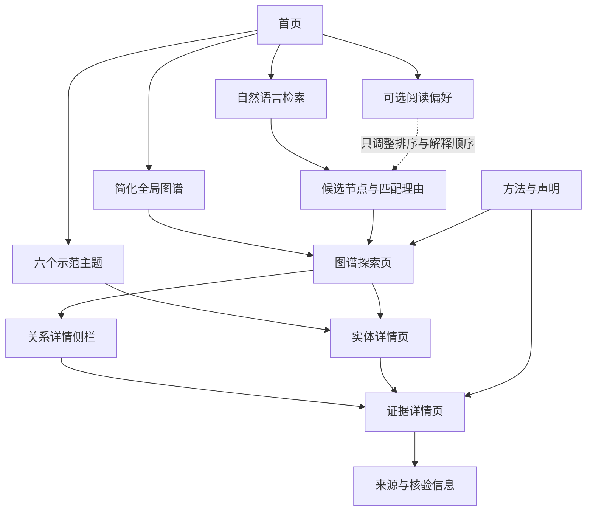

# 医学与先进技术：页面信息架构、内容模板与证据检索方案（审批稿）

状态：已获用户审核；采用“图谱骨架优先型”调整方案，已进入 Astro 页面原型实现

## 1. 本阶段目标

本阶段先确定三个底层问题：

1. 用户从首页如何进入全局图谱、个性化推荐和证据详情；
2. 疾病、科学门类、技术、关系、研究证据和未来方向分别用什么内容模板；
3. 首批六个主题如何检索、筛选、提取和审核学术证据。

完成本阶段后，才能安全地确定具体前端框架、目录结构和首个页面原型。

## 2. 页面信息架构方案

### 方案 A：图谱优先的单页探索器

首页直接展示大面积知识图谱，搜索、筛选、详情卡和证据内容都在同一页面完成。

- 优点：探索感强，能够快速表现项目特色；
- 缺点：科研内容较长时单页容易拥挤，具体关系和证据不便分享、引用和收录；
- 适用：节点少、重点展示视觉效果的短期演示。

### 方案 B：目录与详情页优先

首页以搜索框、主题目录和推荐内容为主，用户进入疾病、技术或科学门类详情页后再查看局部图谱。

- 优点：阅读路径清晰，适合长篇科研内容和公众科普；
- 缺点：全局关联感较弱，容易变成普通医学资料网站；
- 适用：以文章阅读和搜索引擎发现为主要目标的网站。

### 方案 C：双入口混合架构（推荐）

首页同时提供自然语言检索、简化全局图谱和六个示范主题。独立的图谱探索页负责关系发现，统一实体详情页和证据页负责深度阅读。

- 优点：兼顾知识图谱探索、科研阅读、公众理解和链接分享；
- 缺点：需要维护图谱状态与详情页之间的跳转关系；
- 适用：本项目第一版。

#### 推荐的第一版页面

| 页面 | 核心职责 | 第一版是否必需 |
| --- | --- | --- |
| 首页 `/` | 自然语言输入、阅读偏好入口、简化云图、六个示范主题 | 必需 |
| 图谱探索 `/explore` | 全局/推荐双视图、筛选、节点聚焦、关系详情侧栏 | 必需 |
| 实体详情 `/entity/:id` | 统一承载疾病、临床问题、科学门类和技术内容 | 必需 |
| 证据详情 `/evidence/:id` | 展示研究设计、对象、结果、局限和来源 | 必需 |
| 方法与声明 `/methodology` | 说明证据等级、研究阶段、更新规则和医学免责声明 | 必需 |
| 独立来源页 `/source/:id` | 汇总来源元数据和被哪些关系引用 | 可延后；首版可并入证据页 |

关系详情优先使用图谱右侧栏或移动端下方抽屉展示，同时为重要关系保留可分享的地址。这样既保持探索流畅，也方便科研人员引用具体关系。



## 3. 阅读偏好的页面呈现方案

### 方案 A：首页内嵌的可折叠设置（推荐）

在自然语言输入框附近显示“设置阅读偏好（可跳过）”。展开后选择身份和研究方向。

- 优点：可发现但不打断访问；
- 缺点：首页会增加少量信息密度。

### 方案 B：首次访问弹窗

- 优点：身份选择率可能更高；
- 缺点：容易让用户误以为必须提供身份，也会打断首次探索；
- 不建议作为默认方式。

### 方案 C：只放在顶部导航或设置页

- 优点：首页最简洁；
- 缺点：用户可能不知道网站可以调整内容层级。

推荐方案 A。首次访问不弹窗，用户可以跳过、修改或清除偏好。“患者及家属”作为独立身份选项，并始终显示医学信息边界说明。

## 4. 内容模板方案

### 方案 A：所有节点使用同一文章模板

- 优点：开发最简单；
- 缺点：疾病、技术、研究和科学门类的信息结构差异较大，容易出现大量空字段。

### 方案 B：每种节点完全独立设计

- 优点：每类内容最贴合自身特点；
- 缺点：页面和数据结构容易分裂，维护成本高。

### 方案 C：公共骨架 + 类型专属模块（推荐）

所有页面共享标题、别名、类型、更新时间、通俗解释、科研摘要、关联图谱、限制和来源等公共骨架，再按实体类型加载专属模块。

#### 公共骨架

1. 名称、别名和实体类型；
2. 一句话说明；
3. 通俗解释与科研摘要；
4. 当前研究阶段或证据状态；
5. 关联节点和关系；
6. 已知限制、风险和不确定性；
7. 来源、核验日期和审核状态。

阅读偏好只改变“通俗解释”和“科研摘要”的默认顺序，两部分始终可以切换查看。

#### 类型专属模块

| 类型 | 专属内容 |
| --- | --- |
| 疾病/临床问题 | 医学定义、主要医学需求、适用人群边界、相关技术路径 |
| 科学门类 | 核心概念、技术边界、子方向、赋能机制、转化瓶颈 |
| 技术/疗法 | 工作原理、使用场景、关键技术指标、研究阶段、安全与伦理问题 |
| 关系 | 赋能或应用机制、直接证据、研究阶段、限制、相反或不一致证据 |
| 研究证据 | 研究设计、对象/样本、对照、终点、结果、随访、局限、利益冲突信息（如来源披露） |
| 未来方向 | 证据依据、待验证问题、验证路径、近期/中期/长期层级、风险与不确定性 |

### 关系详情卡建议模板

```text
关系标题：康复机器人 → 脑卒中后运动功能障碍
关系类型：应用于 / 可能改善的功能目标
一句话解释：……
赋能机制：……
研究阶段：……
证据概览：……
主要限制：……
相关证据：EVD-001、EVD-002
未来方向：项目分析，与证据事实分区显示
最近核验：YYYY-MM-DD
```

## 5. 证据检索与策展方案

### 方案 A：自由策展

围绕每个主题寻找若干代表性论文和资料，不保存完整检索过程。

- 优点：速度最快；
- 缺点：容易产生选择偏差，后续难以解释为什么选中这些资料。

### 方案 B：结构化快速证据图谱（推荐）

为每个“疾病/临床问题—技术”关系建立检索问题、关键词矩阵、来源清单、纳入理由和证据卡片，但不宣称达到正式系统综述标准。

- 优点：可信度、效率和可维护性比较平衡；
- 缺点：需要记录检索日志和排除理由；
- 适用：第一版人工精选内容。

### 方案 C：小型范围综述流程

按照较严格的范围综述方法，为每个主题记录数据库、完整检索式、时间范围、筛选流程和全部纳入研究。

- 优点：最系统、可复现；
- 缺点：六个首批主题工作量很大，会延迟页面原型；
- 适用：后续重点专题或正式研究成果。

推荐采用方案 B，并吸收方案 C 的三个控制点：保留检索日期与检索式、记录纳入/排除理由、对高风险临床结论进行二次核验。

### 推荐检索流程

1. 将每条关系改写成结构化问题：医学问题/人群、技术、使用情境或对照、关注结果、研究阶段；
2. 建立中英文标准名、别名、技术名和缩写矩阵；
3. 按目标选择来源：监管状态查官方监管来源，试验状态查注册平台，研究结果查原始论文，整体背景查系统综述或指南；
4. 在中国知网、PubMed 等论文平台发现候选研究，并使用 DOI、注册号或机构信息去重和核验；
5. 保存检索日期、检索词、平台、候选来源和排除理由；
6. 由 `evidence-extractor` 形成证据卡片；
7. 由 `graph-curator` 将已审核事实连接到节点和关系；
8. 由 `medical-reviewer` 审核研究阶段、疗效表达、限制和冲突证据；
9. 通过审核后才能进入网站。

### 来源与发布门槛

- 每条关键关系至少有一个能够直接支持其核心事实的原始研究、临床试验记录或官方来源；
- 条件允许时，再补充一项系统综述、指南或权威背景来源；
- “已获批”“临床可用”等结论必须由监管机构、权威指南或等效的一手资料支持；
- 预印本、会议摘要、案例报告和新闻可以作为线索或低等级证据，但必须显著标注，不能单独支撑确定性临床结论；
- 阴性结果、冲突结果和关键局限不能因为不符合预期而排除；
- 不绕过付费墙、登录权限或平台访问控制。

## 6. 首版证据密度方案

### 方案 A：每个核心主题 3—4 张证据卡片

- 优点：最快形成完整原型；
- 缺点：较难覆盖不同研究阶段和冲突证据。

### 方案 B：每个核心主题 5—8 张证据卡片（推荐）

- 优点：通常能够同时放入代表性原始研究、试验记录、综述/指南和局限性证据；
- 缺点：六个主题合计需要约 30—48 张证据卡片，必须分批完成。

### 方案 C：每个核心主题 10—15 张证据卡片

- 优点：内容更全面；
- 缺点：第一版周期明显增加，也容易在页面尚未验证前投入过多内容工作。

原推荐为方案 B，但用户已选择“图谱骨架优先型”调整方案：第一轮先为全部六个主题各建立 2—3 张基础证据卡片和必要关系，形成可审核的全局图谱骨架；完成整体审核后，再选择一个主题扩展到 5—8 张或更高密度的证据卡片。

## 7. 首个垂直样板主题

### 方案 A：脑卒中后运动功能障碍（推荐）

可以同时验证疾病/临床问题、康复机器人、运动控制、医学影像自动化、临床研究和科普解释等多种节点与关系。

### 方案 B：截肢与肢体缺失

技术链条直观，适合展示智能假肢、人机控制和未来研究方向，但与临床试验阶段分类的组合相对单一。

### 方案 C：膝/髋关节骨关节炎

适合验证手术机器人、导航、生物力学和术后康复之间的关系，但容易让首个样板偏向产品与术式介绍。

### 方案 D：脑动脉瘤及相关神经血管疾病

适合展示介入机器人、影像导航和高风险医学信息的审查机制，但医学门槛较高，不适合作为唯一的公众入门样板。

脑卒中后运动功能障碍仍是后续深度样板的优先候选，但根据用户选择，第一轮不预先锁定单一垂直样板。应先完成六个主题的图谱骨架，再根据关系质量、证据可获得性和页面测试需要确定深挖主题。

## 8. 审批后执行顺序

1. 固化页面路由和内容字段，不选择具体视觉风格；
2. 建立 JSON Schema、Markdown 模板和 ID 规范；
3. 为六个核心主题分别建立关键词矩阵和首批关系问题；
4. 每个主题检索并形成 2—3 张基础证据卡片；
5. 由图谱策展和医学审查角色形成可审核的全局图谱骨架；
6. 用户审核整体节点、关系、证据分布和缺口；
7. 再选择一个主题扩展到 5—8 张或更高密度证据卡片；
8. 提供前端技术选型和视觉方案供用户审批；
9. 用户确认后才进入网页编码。

## 9. 已确认组合

用户已确认以下组合：

- 页面信息架构：方案 C，双入口混合架构；
- 阅读偏好呈现：方案 A，首页内嵌、可折叠、可跳过；
- 内容模板：方案 C，公共骨架 + 类型专属模块；
- 证据检索：方案 B，结构化快速证据图谱；
- 第一轮证据密度：每个主题 2—3 张基础证据卡片；
- 执行顺序：先完成六个主题的全局图谱骨架，再选择一个主题深入；
- 深度主题密度：整体图谱审核后，将选定主题扩展到 5—8 张或更高密度证据卡片。

本轮采用“图谱骨架优先型”调整方案，最终决策已并入 `claude.md`。数据规范与六主题骨架已经完成，前端技术路线选择 Astro + React 交互岛 + TypeScript + Cytoscape.js，现已进入页面原型实现。
